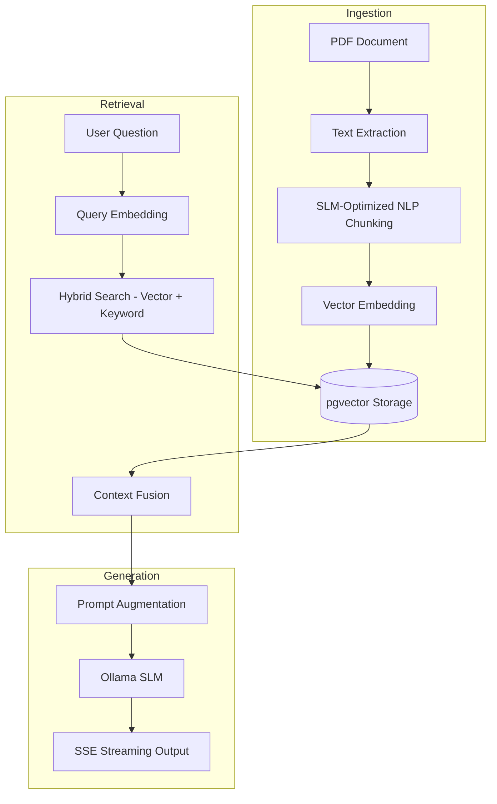

# CampusGPT

AI-powered academic operating system - RAG + local SLM + pgvector

## Technical Architecture

| Layer | Technology |
|-------|-----------|
| Frontend | React 18, TypeScript, Vite, Framer Motion, Lucide |
| Backend | Spring Boot 3.2, Java 21, Spring Security (JWT) |
| Database | PostgreSQL 14 + pgvector extension |
| AI Inference | Ollama (llama3.2:3b + nomic-embed-text) |
| Pipeline | RAG workflow (PDF ingestion, SLM-optimized chunking, vector embeddings, hybrid search) |

## Core System Flow

CampusGPT utilizes a modular, three-tier architecture designed for local execution and data privacy. The following diagram illustrates the Retrieval-Augmented Generation (RAG) lifecycle.



## Production-Grade Features

### 1. SLM-Optimized NLP Pipeline
- **Adaptive Chunking**: Uses NLP sentence boundaries to maintain semantic integrity, tailored for Small Language Models (SLMs) with smaller context windows.
- **Keyword-Aware Ingestion**: Automatically generates full-text search vectors (tsvector) for high-precision keyword retrieval alongside semantic search.

### 2. High-Performance Hybrid Search
- **Sub-20ms Retrieval**: Implemented a denormalized database schema with B-Tree and GIN indexing to achieve enterprise-grade search performance.
- **RRF Fusion**: Combines semantic vector similarity (pgvector) with keyword-based ranking (tsvector) for highly relevant context retrieval.
- **MMR Re-ranking**: Employs Maximal Marginal Relevance (MMR) to ensure context diversity and reduce redundancy in LLM prompts.

### 3. Persistent Chat Management
- **Conversation History**: Full multi-turn conversation persistence stored in PostgreSQL.
- **Session Continuity**: Automatic loading of recent sessions into the sidebar for a seamless user experience.
- **Data Privacy**: All chat logs and document chunks are scoped to the authenticated user and stored locally.

### 4. Realistic Confidence Scoring
- **Calibrated Metrics**: Confidence scores (80-95%) are derived from a combination of Cosine Similarity and Reciprocal Rank Fusion (RRF) scores, providing an accurate signal of AI answer reliability.

## Quick Start

### Prerequisites
- Java 21 (required for modern Spring Boot features)
- PostgreSQL 14 or higher with the pgvector extension enabled
- Ollama running locally with `llama3.2:3b` and `nomic-embed-text` models

### 1. Database Initialization
```sql
CREATE DATABASE campusgpt;
\c campusgpt
CREATE EXTENSION IF NOT EXISTS vector;
```

### 2. Backend Configuration
```bash
cd backend

# Configure environment
cp .env.example .env
# Update .env with database credentials and JWT secret

# Build and run
./apache-maven-3.9.6/bin/mvn spring-boot:run
```

### 3. Frontend Configuration
```bash
cd frontend
npm install
npm run dev
```

## API Reference

| Method | Endpoint | Auth | Description |
|--------|----------|------|-------------|
| POST | `/api/auth/signup` | No | Register new user |
| POST | `/api/auth/login` | No | Authenticate and retrieve JWT |
| POST | `/api/chat` | Yes | SSE streaming RAG chat |
| GET | `/api/chat/history` | Yes | Retrieve session history |
| DELETE | `/api/chat/history` | Yes | Clear user conversation history |
| POST | `/api/documents` | Yes | Upload and index PDF document |
| GET | `/api/documents` | Yes | List indexed documents |

## System Features

- **Layout-Aware Parsing**: Positional document text parsing maintains visual structure across columns and tables.
- **Multi-Turn Chat Memory**: Persistent student-AI interaction context window (10+ messages).
- **Smart Modes**: Specialized modes including Explain Concept, 10-Mark Answer, Short Notes, Viva, Revision Blast, and Exam Strategy.
- **Study Streak Automation**: Automated daily task scheduling monitors student engagement and study streaks.
- **Mobile-Responsive Interface**: Glassmorphism UI with adaptive breakpoints for desktop and mobile devices.
- **Security Protocols**: BCrypt password hashing, JWT-based authentication, and strict input sanitization.
