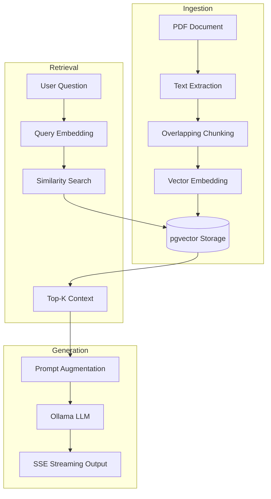

# CampusGPT

> AI-powered academic operating system — RAG + local LLM + pgvector

## Tech Stack

| Layer | Technology |
|-------|-----------|
| Frontend | React 18, TypeScript, Vite, Framer Motion, Lucide |
| Backend | Spring Boot 3.2, Java 17, Spring Security (JWT) |
| Database | PostgreSQL 14 + pgvector extension |
| AI | Ollama (llama3.2:3b + nomic-embed-text) |
| Architecture | RAG pipeline (PDF → chunks → embeddings → vector search → LLM) |

## Architecture Overview

CampusGPT is built on a modular, three-tier architecture designed for local execution and data privacy.

| Layer | Component | Responsibility |
|-------|-----------|----------------|
| **Presentation** | React / Tailwind | Responsive, glassmorphism-themed user interface. |
| **Logic** | Spring Boot | Orchestrates RAG workflows, authentication, and session management. |
| **Persistence** | PostgreSQL | Stores document metadata and high-dimensional vectors. |
| **Intelligence** | Ollama | Local inference for embeddings and LLM responses. |

## System Flow

The following diagram illustrates the Retrieval-Augmented Generation (RAG) lifecycle, from document ingestion to contextual response generation.



## Quick Start

### Prerequisites
- Java 17 (set `JAVA_HOME` to your Java 17 installation)
- PostgreSQL 14 with pgvector extension enabled
- Ollama running locally with `llama3.2:3b` and `nomic-embed-text` pulled

### 1. Database Setup
```sql
CREATE DATABASE campusgpt;
\c campusgpt
CREATE EXTENSION IF NOT EXISTS vector;
```

### 2. Backend
```bash
cd backend

# Copy env config
cp .env.example application-local.properties
# Edit application.properties with your DB credentials and JWT secret

# Build with bundled Maven (requires JAVA_HOME = Java 17)
export JAVA_HOME=/path/to/jdk17
./apache-maven-3.9.6/bin/mvn clean package -DskipTests

# Run
./apache-maven-3.9.6/bin/mvn spring-boot:run
# → Backend on http://localhost:8080
```

### 3. Frontend
```bash
cd frontend
npm install
npm run dev
# → Frontend on http://localhost:5173
```

Performance note:
- The repo now defaults to `llama3.2:3b` for better local latency while keeping good answer quality.
- If you want heavier answers and can tolerate slower responses, set `OLLAMA_MODEL=llama3`.

## API Reference

| Method | Endpoint | Auth | Description |
|--------|----------|------|-------------|
| POST | `/api/auth/signup` | No | Register new user |
| POST | `/api/auth/login` | No | Login, returns JWT + streakCount |
| POST | `/api/documents` | Yes | Upload + index PDF |
| GET | `/api/documents` | Yes | List user's documents |
| DELETE | `/api/documents/{id}` | Yes | Delete document |
| GET | `/api/chat/stream` | Yes | SSE streaming RAG chat |
| PUT | `/api/user/profile` | Yes | Update username/email |
| PUT | `/api/user/password` | Yes | Change password |

## Features

- **RAG Pipeline** — PDFs chunked, embedded via Ollama, stored natively in pgvector with HNSW similarity indexing for ultra-low latency searches
- **Layout-Aware PDF Extraction** — Contextual and positional document text parsing to maintain visual structure spanning columns and tables
- **Multi-Turn Chat Memory** — Seamless continuation of conversation referencing prior student-AI interactions, persisted across Ollama completions
- **6 Smart Modes** — Explain Concept, 10-Mark, Short Notes, Viva, Revision Blast, Exam Strategy
- **Study Streak Automation** — Background daily task scheduling continuously tracks and resets student study streaks upon inactivity to drive engagement
- **Mobile-Native OS Interface** — Responsive layout equipped with adaptive breakpoints and a glassmorphism bottom-navigation bar tailored for smartphones
- **Settings** — Live profile and password update with JWT refresh
- **Security** — BCrypt passwords, JWT auth, rate limiting, input sanitization

## Project Structure

The repository is organized into distinct frontend and backend modules to separate concerns and facilitate independent scaling.

```text
Root
├── backend/                Spring Boot Application
│   ├── src/main/java/      Source code (Auth, Chat, Document, Security)
│   ├── src/main/resources/ Configuration and environment templates
│   └── pom.xml             Dependency management
└── frontend/               React Application
    ├── src/                Components, hooks, pages, and context
    ├── public/             Static assets
    └── package.json        Frontend dependencies and scripts
```

## Environment Variables

```
# backend/.env.example — DB, JWT, and Ollama config
# frontend/.env.example — VITE_API_BASE_URL
```
