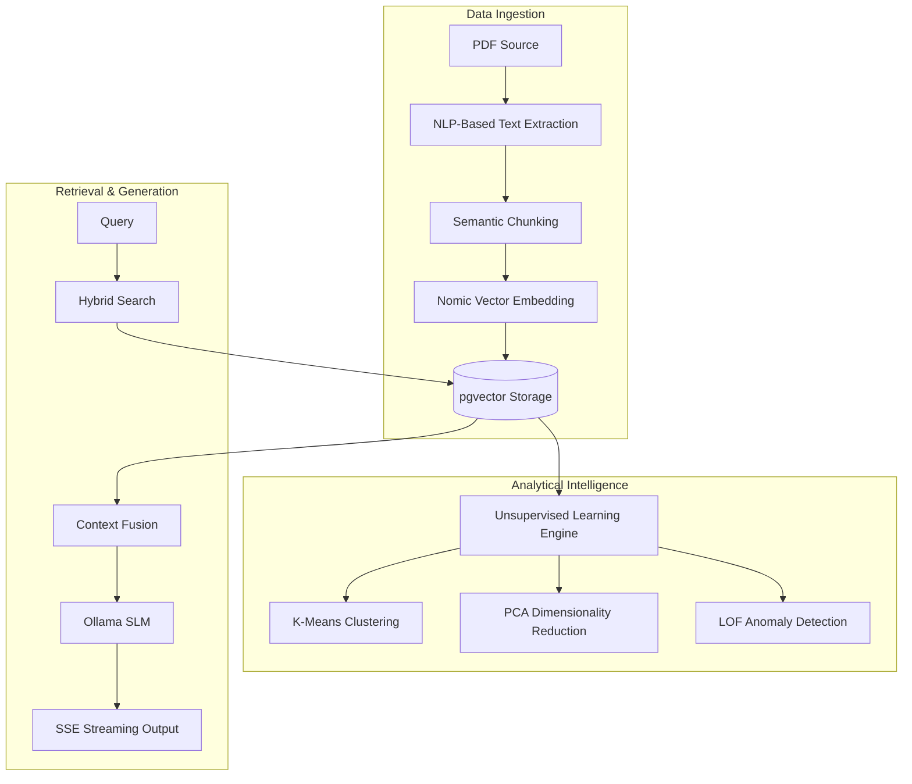

# CampusGPT: Enterprise-Grade Academic Operating System

CampusGPT is a localized, high-performance academic assistance platform built on a Retrieval-Augmented Generation (RAG) architecture. It integrates Small Language Models (SLMs) with advanced vector search and unsupervised machine learning to provide students with a secure, private, and highly efficient study environment.

## Technical Architecture

| Layer | Implementation |
|-------|-----------|
| Frontend | React 18, TypeScript, Vite, Framer Motion, Tailwind CSS |
| Backend | Spring Boot 3.2, Java 25, Spring Security (JWT), Hibernate |
| Database | PostgreSQL 16 + pgvector extension |
| AI Inference | Ollama (Llama 3.2:3B + Nomic-Embed-Text) |
| Pipeline | RAG workflow with Hybrid Search and Unsupervised Analytics |

## Core System Flow

The system employs a multi-stage pipeline designed for low-latency retrieval and high-fidelity generation.



## Principal Capabilities

### 1. Unsupervised Learning & Embedding Analytics
The platform features a specialized analytics engine that provides transparency into the AI's internal representation of uploaded documents:
- **K-Means Clustering**: Automatically categorizes document chunks into distinct conceptual groups, revealing the document's thematic structure.
- **PCA Visualization**: Reduces high-dimensional embeddings (768-D) to a 2D map, allowing users to visualize semantic relationships between topics.
- **Anomaly Detection**: Utilizes Local Outlier Factor (LOF) to identify and flag irrelevant or non-contextual data segments (e.g., indexes, advertisements).
- **Layman Reporting**: Translates complex mathematical metrics (Silhouette Score, Inertia) into human-readable insights regarding document quality and organization.

### 2. High-Performance RAG Infrastructure
- **Hybrid Search Engine**: Combines pgvector semantic similarity with full-text keyword search (tsvector) for precise retrieval.
- **Sub-20ms Latency**: Optimized database schema and HNSW indexing ensure near-instantaneous context retrieval.
- **VRAM Persistence**: Configured with a background 'keep-alive' strategy to prevent model offloading, ensuring zero-latency response generation.
- **Expert Personas**: Includes specialized AI modes (Explain Concept, 10-Mark Answer, Viva Prep, Exam Strategy) with unique system instructions and output templates.

### 3. Advanced User Experience Features
- **Session Persistence**: Full multi-session management with individual chat thread tracking and selective deletion.
- **Interactive Code Blocks**: Integrated code rendering with a functional clipboard synchronization system and visual confirmation.
- **Dynamic Visual Feedback**: Implementation of animated "Thinking" states and real-time retrieval metrics (DB Latency, Confidence Score).
- **Flexible Profiles**: Modernized authentication system supporting mixed-case, space-aware usernames and study streak automation.

## System Configuration

### Prerequisites
- Java 21 or higher (Java 25 recommended)
- PostgreSQL 14+ with pgvector extension enabled
- Local Ollama instance with Llama 3.2 and Nomic-Embed-Text models

### Database Initialization
```sql
CREATE DATABASE campusgpt;
\c campusgpt
CREATE EXTENSION IF NOT EXISTS vector;
```

### Backend Deployment
```bash
cd backend
# Configure .env with database credentials and JWT_SECRET
./mvnw spring-boot:run
```

### Frontend Deployment
```bash
cd frontend
npm install
npm run dev
```

## Security and Compliance
- **OWASP A03/A07 Mitigation**: Strict input sanitization and unified error messaging for authentication security.
- **BCrypt Hashing**: Industry-standard password encryption.
- **JWT Authentication**: Stateless, token-based session management.
- **Local Sovereignty**: All data, including embeddings and chat history, remains on the user's local hardware.
